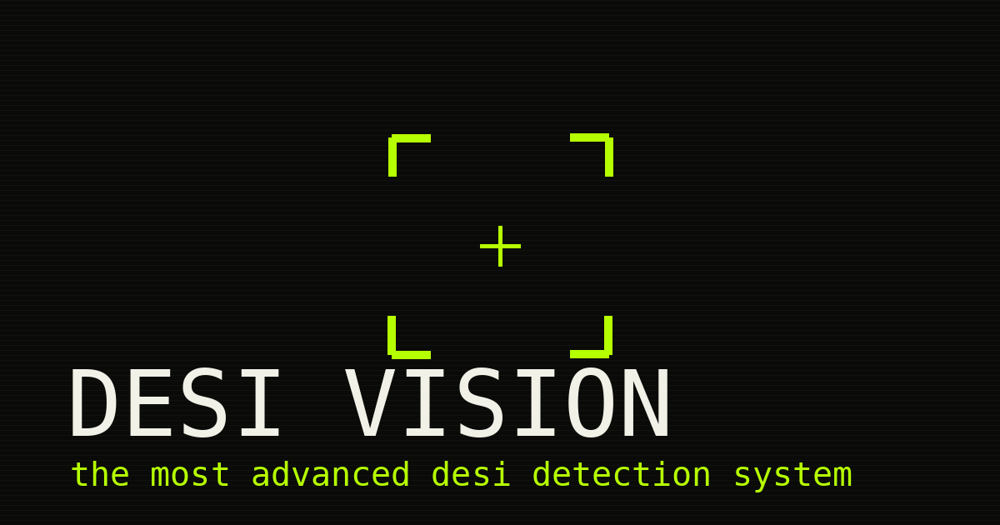

# Desi Vision



> DESI VISION is a satirical Indian village-themed camera detection party game. Point your camera at the real world to catch targets like HOOKAH, TRACTOR, CHARPAI, and STEEL GLASS. It is a playable parody of real-time object detection that stays honest about what the model can and cannot actually recognize.


This is a fictional parody created for entertainment and humor. It does not represent, endorse, promote, or make claims about any real community, culture, person, or behavior.

First committed and deployed on 2026-09-25. The game is live at https://desi-vision.vercel.app.

## Tech Stack

    

- **React 19** with **TypeScript**
- **TensorFlow.js** (`@tensorflow/tfjs`) with the **COCO-SSD** model (`@tensorflow-models/coco-ssd`)
- **Vite** (build tool and dev server)
- **Tailwind CSS v4** (styling)
- **Framer Motion** (animations)

### Why this stack

- **TensorFlow.js + COCO-SSD**: runs object detection entirely in the browser, so there is no backend to host and camera frames never leave the device.
- **React + TypeScript**: component-based game UI with static types for the game logic and detection interface.
- **Vite**: fast dev server and quick production builds.
- **Tailwind CSS**: utility-first styling for the game HUD and screens without a custom stylesheet.
- **Framer Motion**: spring and scan animations for target cards, catches, and mode transitions.

## Features

- **QUICK CATCH**: 60 second round, catch as many targets as possible.
- **CHAOS MODE**: 45 seconds, targets rotate every 6 seconds and your combo resets when one escapes.
- **FREE SCAN**: no timer, no scoring. Explore what the AI actually recognizes.
- **Honest assisted tagging**: unmappable targets (HOOKAH, GAMCHA, JUTTI) fall back to a manual tag. A tap is a tap, not a detection, and the game never claims the AI saw it.
- **Combo scoring**: each target has a base XP value, plus 50 bonus XP per combo level. Combos grow with consecutive catches.
- **On-device processing**: the camera stream never leaves your device. All sounds are synthesized with the Web Audio API. Zero audio files.
- **Pluggable vision layer**: the detection code lives behind a small interface (`src/vision/detector.ts`), so a better model can be plugged in later without touching game logic.

## Quick Start

### Prerequisites

- Node.js and npm
- A browser with camera access. Use HTTPS or localhost; the camera requires a secure context.

Stack versions (from `package.json`): React 19, Vite 8, TypeScript 6, Tailwind CSS v4, TensorFlow.js 4 with COCO-SSD.

### Installation

1. Clone the repository:

```bash
git clone https://github.com/p3xz/desi-vision.git
cd desi-vision
```

2. Install dependencies:

```bash
npm install
```

3. Start the dev server:

```bash
npm run dev
```

4. Open the printed local URL, press **START SCAN**, allow the camera, and start catching.

Production build:

```bash
npm run build
npm run preview
```

## Usage

Run the dev server, open the printed URL, and press **START SCAN**:

```bash
npm run dev
```

Grant camera access, then point the camera so a target is clearly visible to catch it.

## Controls

| Action | How |
|---|---|
| Catch a target | Point the camera so the object is clearly visible |
| Manual-tag targets (HOOKAH, GAMCHA, JUTTI) | Tap the object on screen to place an assisted tag |
| Pause / quit | EXIT button in the top bar |
| Mute | SOUND toggle in the top bar or start screen |

## How it works

- **Camera**: `getUserMedia` with the rear camera preferred on mobile. The stream never leaves your device.
- **Detection**: TensorFlow.js with the COCO-SSD model, lazy-loaded only after you grant camera access so the start screen stays fast. Model weights are fetched from a CDN at runtime.
- **Game loop**: every ~700ms the current video frame is checked against the active target. A COCO-SSD label matching the target's class list at 55%+ confidence triggers a catch.
- **Sounds**: all synthesized with the Web Audio API. Zero audio files.

## Honest note on detection limits

COCO-SSD was trained on 80 everyday object classes (chair, cup, bottle, cow, truck, bed, and friends). It has never seen a hookah, a gamcha, or a jutti, and this game never pretends otherwise:

- Mappable targets use the closest real COCO class (buffalo to cow, tractor to truck, charpai to bed) and the mapping is shown on the target card.
- Unmappable targets (HOOKAH, GAMCHA, JUTTI) switch to an honest fallback: the game says **OBJECT TOO DESI TO CLASSIFY** and asks you to tap the object to place an **ASSISTED TAG**. A tap is a tap, not a detection, and the game never claims the AI saw it.
- In FREE SCAN you can watch the raw model output: every label shown is a real model prediction with its real confidence score.

## Privacy

Camera footage is processed on-device and never uploaded, stored, sold, or shared. Scores and settings live in your browser's localStorage. See the in-game Privacy page for the full policy, including the runtime CDN fetch of the COCO-SSD model files.

## Contributing

Found a bug or have a target idea? Open an issue or a pull request on GitHub. Keep changes genuine: working code, clear descriptions, tested locally.

## Credits

Created by [Namish Yadav](https://github.com/p3xz). © 2026 Desi Vision.

## License

MIT licensed. Copyright (c) 2026 p3xz. See the [LICENSE](LICENSE) file for details.
